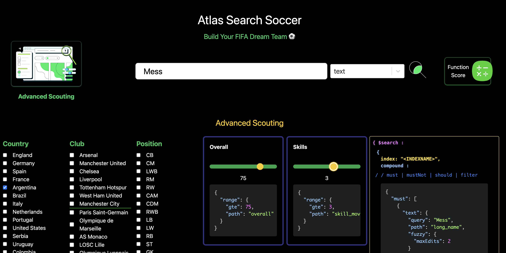

<h1 align="center">Atlas Search Soccer</h1>

<h2 align="center">Build your FIFA Dream Team with MongoDB Atlas Search</h2>

Hello! 👋

In May 2022, Electronic Arts and FIFA consciously decoupled after 30 years of bringing gaming bliss to soccer enthusiasts across the globe. 😔 😢 I am neither a gamer nor a soccer enthusiast, but I am a soccer mom. The EA Sports FIFA gaming franchise never failed to provide me with countless hours of wholesome and free babysitting. Park your child in front of any gaming console with EA FIFA, and there he/she would stay. Amused, entertained, but mostly still and **_not breaking anything_**!!

EA Sports FIFA, <a href="https://www.atlassearchsoccer.com"><b>Atlas Search Soccer</b></a> is my tribute to you. Part eulogy, part love song. Oh yeah, and part Atlas Search tutorial.

    

Teaming up MongoDB Atlas Search with the FIFA22 player dataset, you can scour across the over 22,000 players in the database based on a variety of search parameters and data types:

- player name
- player position
- nationality
- club
- skill level
- age
- salary

Equipped with only a searchbox, sliders and checkboxes, find the world's best players with the most inpossible-to-spell names to build out your own FIFA Dream Team. Autocomplete, wildcard, and filters to find Ibrahimović, Błaszczykowski, and Szczęsny? No problem!

    

As you interact with the application, you'll see the `$search` operator in a MongoDB aggregation pipeline live in-action! Click on the Advanced Scouting image for more options using the `compound`. Learn all the ways and plays to build complex, fine-grained full-text searches across text, date, and numerics.

When you pick a footballer for your team, he is written to local storage on your device. That way, your Dream Team stays warmed up and on the pitch even after you close your browser.

<h4>Skills and Drills</h4>

- search operators:
  - text
  - wildcard
  - autocomplete
  - range
- fuzzy matching
- indexes and analyzers
- compound operator
- relevance based scoring
- custom score modifiers
- filters, facets and counts

So give it a shot, and you'll be an Atlas Search pro in no time!

<h4 align="center"> <a href="https://www.atlassearchsoccer.com">www.atlassearchsoccer.com</a>  ⚽ </h4>

    

<h6>Game Notes 📝</h6>

This application is hosted entirely by MongoDB Atlas was created using:

- React
- Tailwind CSS
- MongoDB Realm for backend HTTPs endpoints and webhooks
- A [FIFA22 player dataset](https://www.kaggle.com/datasets/bryanb/fifa-player-stats-database)

<em>Currently this app is not suitable for mobile, but feel free to send a PR.</em> 😊

<h4>Want to play in your own stadium? Here's how to build Atlas Search Soccer on your own free cluster.
</h4>

Atlas Search Soccer runs on a very streamlined game plan where MongoDB Atlas is the MVP.
**No additional servers or software needed. No need to keep data in sync. Everything is done in MongoDB Atlas.**

    

<h3>Prerequisites</h3>

- A MongoDB Atlas account. Get one for free <a href="https://www.mongodb.com/cloud/atlas">here.</a>
- A recent version of Node.js and npm.
- EA FIFA 22 player dataset (players22.json) provided in the data folder.
- (Recommended) <a href="https://www.mongodb.com/try/download/compass">MongoDB Compass - GUI</a>

It is also included in this repo's data folder as <pre>players22.json</pre>

---

<h6>To Run This Application....</h6>

1. Clone the repo.
2. Navigate inside `atlas-search-soccer` directory.
3. Run <code>npm install</code> .
4. Run <code>npm start </code> .

---

<h6>Prepare Data</h6>

Load data to Atlas cluster:

<ul>
<li>database: <code>soccer</code></li>
<li>collection: <code>players22</code></li>
</ul>

<h2>React Components....</h2>

  
   
  

<h2>Using Atlas App Services as Your Serverless Backend....</h2>

AtlasSearchSoccer uses HTTP services in App Services to create 5 APIs to allow you to query for your restaurant data over HTTP: 

The data is queried from `useHomeFetch.js` in the `hooks` directory.
Here you'll find the endpoints for the backend search queries using the `$search` operator:

- `BasicSearchEndPoint`
- `WildcardEndPoint`
- `AutocompleteEndpoint`
- `AdvancedSearchEndPoint`
- `FacetsEndPoint`
  Find the code for these webhooks in the <code>AppServices</code> folder.

If you have any questions or feedback about this repo, feel free to create an Issue or PR in this repo or reach out to me on Twitter @YouOldMaid.

Also please join our online <a href="https://developer.mongodb.com/community/forums/">MongoDB Community</a> to interact with our product and engineering teams along with thousands of other MongoDB and Realm users. 
  Have fun and happy coding!
</h4>
